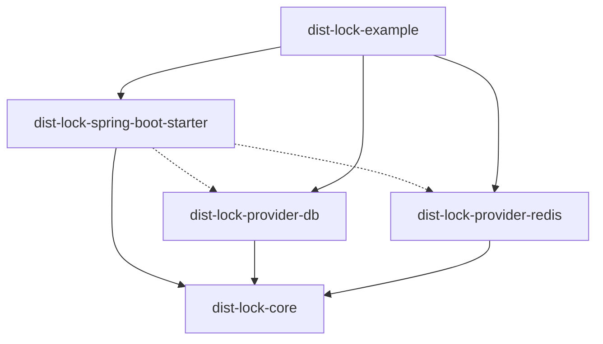
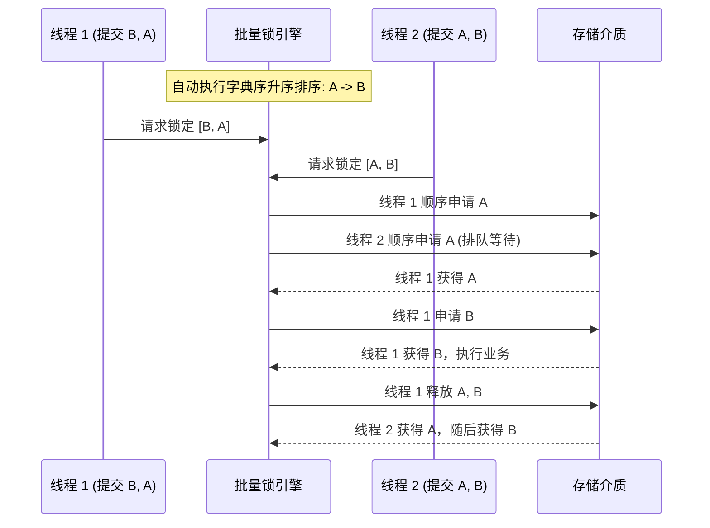
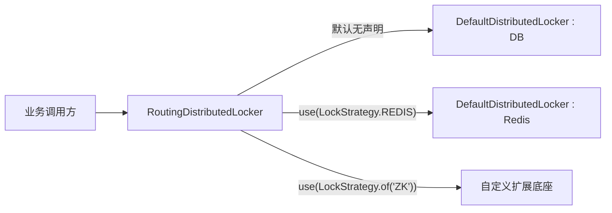

# 分布式锁通用组件设计与技术规格说明书

本文档系统性阐述分布式锁通用组件的技术背景、架构设计、数学模型、核心运行机制及使用手册，为后续维护与功能扩展提供技术依据。

---

## 1. 架构目标与设计原则

### 1.1 背景问题
传统分布式锁在工程实践中普遍存在以下缺陷：
1. **字符串拼接 Key 冲突**：业务代码手动拼接 Key 易发生不同业务模块 ID 相同导致的锁互斥，或因前缀定义不统一导致锁击穿；
2. **批量加锁导致死锁**：在购物车结算、多库存扣减等集合场景下，并发线程逆序请求多个资源导致循环等待死锁；
3. **数据库长连接占用**：传统数据库锁依赖长事务或行级悲观锁（`SELECT ... FOR UPDATE`），长时间占用物理连接，导致数据库连接池耗尽；
4. **服务器时钟漂移**：多节点物理机时钟存在偏差，本地计算超时时间导致租约提早失效或并发穿透；
5. **API 冗余与两阶段割裂**：引入繁琐的构建器与方法后缀，缺乏业务结论的直接交付能力。

### 1.2 核心设计原则
* **无状态轻量化**：核心状态下沉至存储介质，应用节点自身无状态；
* **开闭原则（OCP）**：门面接口不与具体存储底座（DB、Redis、ZK）硬编码绑定，策略对象可自主传递与扩展；
* **环境自适应发现**：摒弃传统 Java `ServiceLoader` 机制，依托 Spring Boot 容器上下文实现底座自动探测与注册；
* **偏序排序防死锁**：集合资源加锁前执行自然字典序升序排列，破坏死锁形成的环路等待条件；
* **连接即时归还**：数据库交互采用单条 CAS 更新，SQL 交互完成后即刻将连接归还连接池。

---

## 2. 模块划分与依赖拓扑

项目采用多模块 Maven 架构构建：

```text
dist-lock
├── dist-lock-core                     # 核心抽象层：门面接口、策略模型、退避算法、看门狗引擎
├── dist-lock-provider-db              # 关系型数据库存储实现：ANSI-SQL CAS 租约
├── dist-lock-provider-redis           # Redis 存储实现：原子指令与 Lua 脚本
├── dist-lock-spring-boot-starter      # Spring Boot 自动配置与路由容器装配
└── dist-lock-example                  # 实战案例工程
```

### 依赖关系图


---

## 3. 核心设计原理

### 3.1 锁唯一标识生成机制（全限定类名隔离）
为消除人工命名空间导致的重名或拼写错误，组件采用实体对象的全限定类名作为天然命名空间：

$$\text{LockKey} = \text{CleanClassName} + \text{":"} + \text{KeyExtractor}(data)$$

#### 动态代理剥离算法
针对 Spring AOP、CGLIB、Hibernate、ByteBuddy 生成的运行时代理子类，算法通过识别 `$$` 分隔符自动还原基类全路径：

```java
private String resolveNamespace(Object obj) {
    if (obj == null) return "Unknown";
    Class<?> clazz = obj.getClass();
    String className = clazz.getName();
    int proxyIndex = className.indexOf("$$");
    return proxyIndex > 0 ? className.substring(0, proxyIndex) : className;
}
```

* **隔离保证**：`com.mall.order.OrderDTO:1001` 与 `com.mall.user.UserAccountDTO:1001` 在底层存储中严格隔离，互不干扰。

---

### 3.2 集合批量加锁与死锁数学消除

#### 死锁产生的充要条件
根据 Coffman 模型，死锁产生需同时满足：互斥、占有且等待、不可抢占、循环等待。
在多键加锁场景下，消除**循环等待（Circular Wait）**即可杜绝死锁。

#### 排序消除法
若两个线程按相反顺序申请资源集合 $\{K_1, K_2\}$，会产生交叉锁等待死锁。
组件在加锁前执行全局标准化处理：
1. 过滤空值；
2. 提取业务键；
3. 执行 `distinct()` 去重；
4. 执行自然字典序升序排列（`sorted()`）。

所有请求按偏序结构 $K_{(1)} < K_{(2)} < \dots < K_{(n)}$ 顺序申请资源，不可产生加锁环路。



#### 逆序原子回滚
若批量加锁过程中任意一个 Key 在超时时间内未成功获取，引擎中断流程，按照已获取集合的逆序列表 $[K_{(m)}, \dots, K_{(1)}]$ 执行释放，杜绝中间锁残留。

---

### 3.3 数据库 CAS 租约机制（ANSI-SQL）

#### 数据表规格
```sql
CREATE TABLE IF NOT EXISTS dist_lock (
  lock_key VARCHAR(255) NOT NULL,
  owner VARCHAR(128) NOT NULL DEFAULT '',
  expire_time BIGINT NOT NULL DEFAULT 0,
  version BIGINT NOT NULL DEFAULT 0,
  created_at TIMESTAMP DEFAULT CURRENT_TIMESTAMP,
  updated_at TIMESTAMP DEFAULT CURRENT_TIMESTAMP,
  PRIMARY KEY (lock_key)
);
```

#### 原子争抢状态转移
抢锁通过单条 CAS `UPDATE` 语句执行：
```sql
UPDATE dist_lock 
SET owner = :newOwner, 
    expire_time = :newExpireTime, 
    version = version + 1 
WHERE lock_key = :lockKey 
  AND (expire_time < :currentTime OR owner = :newOwner)
```
* **更新行数为 1**：成功占有或重入；
* **更新行数为 0**：当前被其他节点有效持有，更新失败；
* **若记录不存在**：执行 `INSERT INTO dist_lock ...`，依赖主键唯一约束保证原子性。唯一键冲突异常（`DataIntegrityViolationException`）被静默捕获，判定为争抢未命中。

#### 时钟漂移消除
组件通过数据库服务端时钟获取基准时间：
```sql
SELECT CURRENT_TIMESTAMP
```
所有节点基于数据库统一时间戳计算绝对失效时间（`dbTime + leaseMillis`），屏蔽各应用节点物理机时钟误差。

---

### 3.4 Redis 原子操作与 Lua 脚本机制

Redis 存储实现采用原生原子命令结合 Lua 脚本：

1. **加锁**：
   ```text
   SET lock_key owner NX PX lease_millis
   ```
2. **原子释放（Lua 脚本）**：
   ```lua
   if redis.call('get', KEYS[1]) == ARGV[1] then
       return redis.call('del', KEYS[1])
   else
       return 0
   end
   ```
3. **原子看门狗续期（Lua 脚本）**：
   ```lua
   if redis.call('get', KEYS[1]) == ARGV[1] then
       return redis.call('pexpire', KEYS[1], ARGV[2])
   else
       return 0
   end
   ```

---

### 3.5 看门狗（Watchdog）自动续期引擎

* **调度频率**：设租约时长为 $L$，续期周期计算为 $\Delta t = \frac{L}{3}$；
* **线程模型**：内部维护守护单线程定时调度池（`ScheduledExecutorService`）；
* **生命周期约束**：加锁成功后注册锁条目；业务闭包执行结束（包括正常退出或异常抛出），在 `finally` 块中立即触发注销并终止续期调度。

---

### 3.6 自适应退避算法（Adaptive Backoff with Full Jitter）

为规避高并发锁争抢时的惊群效应，重试等待时间采用全抖动指数退避：

$$T_{\text{sleep}} = \text{random}(0, \min(T_{\text{max}}, T_{\text{base}} \times 2^{\text{attempt}}))$$

* $T_{\text{base}} = 10\text{ ms}$
* $T_{\text{max}} = 200\text{ ms}$

---

## 4. 多底座策略自主发现与混合路由

### 4.1 策略对象模型
```java
@FunctionalInterface
public interface LockStrategy {
    String name();

    LockStrategy DATABASE = () -> "DATABASE";
    LockStrategy REDIS = () -> "REDIS";
    LockStrategy ZOOKEEPER = () -> "ZOOKEEPER";

    static LockStrategy of(String name) {
        return () -> name.trim().toUpperCase();
    }
}
```

### 4.2 容器自动发现机制
组件规避传统 Java SPI 文件，基于 Spring Boot 依赖探测自动装配：
1. 类路径存在 `DataSource` 且存在该 Bean $\to$ 激活 `databaseLockStorageProvider` 与 `dbLocker`；
2. 类路径存在 `StringRedisTemplate` 且存在该 Bean $\to$ 激活 `redisLockStorageProvider` 与 `redisLocker`；
3. 装配 `RoutingDistributedLocker` 作为 `@Primary` 门面：
   * 默认路由指向 `DATABASE`；
   * 业务通过 `.use(LockStrategy.REDIS)` 动态路由至 Redis 引擎。



---

## 5. 使用手册

### 5.1 Maven 依赖引入
```xml
<dependency>
    <groupId>com.distlock</groupId>
    <artifactId>dist-lock-spring-boot-starter</artifactId>
    <version>1.0.0-SNAPSHOT</version>
</dependency>
```

### 5.2 基础用例：单对象加锁（直接获取结论）
```java
@Autowired
private DistributedLocker locker;

// 单对象加锁执行业务逻辑并返回结果
OrderResult result = locker.lock(
    order, 
    OrderDTO::getOrderId, 
    o -> orderService.pay(o)
);
```

### 5.3 基础用例：单对象消费（无返回值）
```java
locker.lock(
    order, 
    OrderDTO::getOrderId, 
    o -> orderService.cancel(o)
);
```

### 5.4 锁策略自主选择（DB 与 Redis 混合调用）
```java
// 1. 常规业务（默认路由至数据库租约锁）
OrderResult res1 = locker.lock(order, OrderDTO::getOrderId, o -> orderService.pay(o));

// 2. 高频秒杀业务（自主指定路由至 Redis 锁）
boolean res2 = locker.use(LockStrategy.REDIS).lock(
    seckillItem, 
    SeckillDTO::getSkuCode, 
    item -> seckillService.deductStock(item)
);
```

### 5.5 多维度错误与降级处理

#### 默认固定提示
未传入自定义文案时，争抢超时统一抛出 `LockTimeoutException`，错误信息固定为：
`系统繁忙，当前业务正在处理中，请稍候重试`。

#### 自定义友好错误文案
```java
OrderResult result = locker.lock(
    order, 
    OrderDTO::getOrderId, 
    "当前订单正在处理中，请勿重复提交", 
    o -> orderService.pay(o)
);
```

#### 抛出自定义业务异常（对接全局 `@ExceptionHandler`）
```java
OrderResult result = locker.lock(
    order, 
    OrderDTO::getOrderId, 
    () -> new BusinessException(1001, "账户资金已锁定"), 
    o -> orderService.pay(o)
);
```

#### 函数式值降级（不中断业务）
```java
OrderResult result = locker.lock(
    order, 
    OrderDTO::getOrderId, 
    3, TimeUnit.SECONDS,
    o -> orderService.pay(o),              // 正常执行
    o -> OrderResult.busy(o)               // 降级兜底
);
```

### 5.6 集合批量加锁（自动消除死锁）
```java
boolean success = locker.lock(
    items, 
    OrderItemDTO::getSkuCode, 
    "购物车部分商品结算冲突，请重试", 
    list -> stockService.deductBatch(list)
);
```

---

## 6. 底座扩展开发指南

若需引入新的底层存储（如 Zookeeper、Etcd），遵循以下步骤：

### 步骤 1：实现 `LockStorageProvider`
```java
public class ZookeeperLockStorageProvider implements LockStorageProvider {
    @Override
    public boolean tryAcquire(String lockKey, String owner, long leaseMillis) {
        // ZK 临时顺序节点实现
    }

    @Override
    public boolean release(String lockKey, String owner) {
        // 节点删除实现
    }

    @Override
    public boolean renew(String lockKey, String owner, long leaseMillis) {
        return true;
    }

    @Override
    public long getStorageTimeMillis() {
        return System.currentTimeMillis();
    }
}
```

### 步骤 2：在 Spring 配置中注入 Bean
```java
@Configuration
public class CustomLockConfiguration {

    @Bean(name = "zkLocker")
    public DefaultDistributedLocker zkLocker(CuratorFramework client) {
        LockStorageProvider provider = new ZookeeperLockStorageProvider(client);
        return new DefaultDistributedLocker(provider, LockStrategy.ZOOKEEPER);
    }
}
```

Starter 容器在启动阶段通过 `ObjectProvider` 自动搜集 `zkLocker` 并注入 `RoutingDistributedLocker`。业务端直接通过下述语法调用：
```java
locker.use(LockStrategy.ZOOKEEPER).lock(data, keyExtractor, action);
```
无需修改任何框架代码，满足开闭原则。
