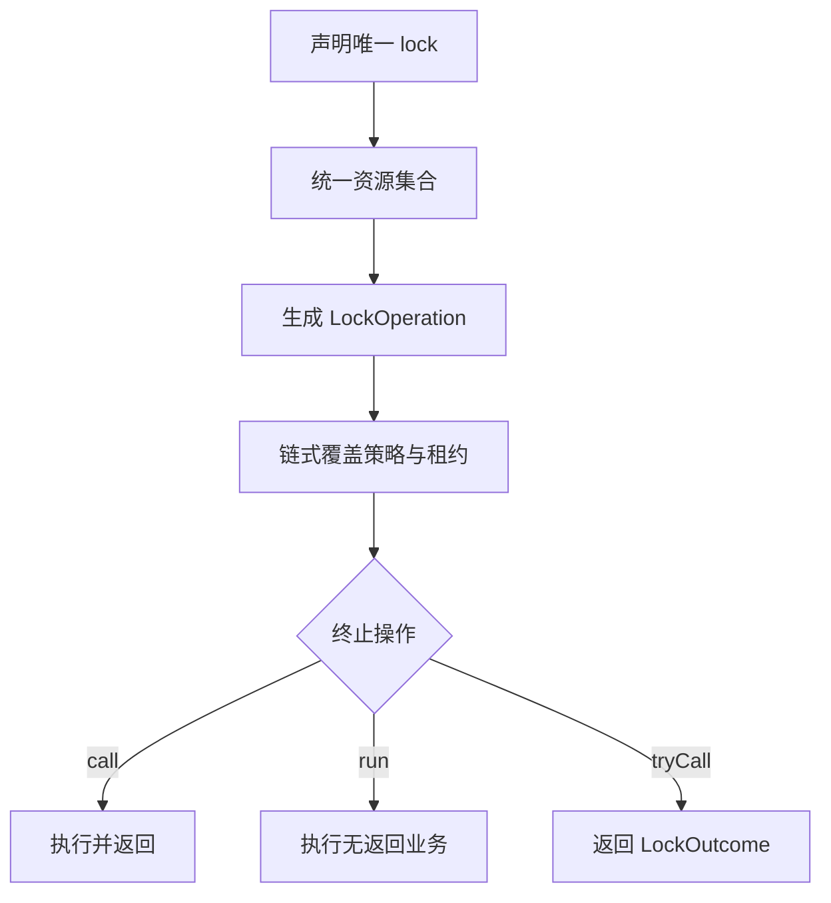

# 分布式锁技术规格

## 1. 设计目标

组件将三个相互独立的关注点分开：

1. `DistributedLocker.lock`：通过唯一入口声明单个或批量业务资源；
2. `LockOperation`：不可变的链式配置；
3. `call/run/tryCall`：终止配置并执行业务。

公开接口只有一个 `lock(resourceOrResources, keyExtractor)`，不再通过重载排列单对象、集合、超时、租期、策略、返回值和失败处理。单对象在内部包装为单元素集合，之后统一执行校验、取键、去重、排序、获取、续期和释放。增加配置项时只扩展 `LockOperation`，不会复制执行方法。

## 2. API 生命周期



示例：

```java
LockOperation paymentLock = locker
    .lock(order, Order::getOrderId)
    .strategy(LockStrategy.DATABASE)
    .waitTimeout(Duration.ofSeconds(3))
    .leaseTime(Duration.ofSeconds(30))
    .watchdog(true);

OrderResult result = paymentLock.call(() -> paymentService.pay(order));
```

配置阶段不会访问存储。只有调用 `call`、`run` 或 `tryCall` 才开始获取锁。

## 3. 锁键规范

调用方提供业务对象和取键函数，namespace 默认从资源对象的稳定用户类推导：

```java
locker.lock(order, Order::getOrderId);
locker.lock(stocks, SkuStock::getSkuCode);
```

锁键由 namespace 的全限定类名、取键结果的实际类型和业务键组成：

```text
qualified-key = "dist-lock:v1:" + namespace-class-name + ":" + key-class-name + ":" + business-key
```

组件会剥离常见 CGLIB/Hibernate 代理子类，尽量解析为稳定用户类。不同资源类型即使提取出相同值，也不会发生无关锁竞争。字符串 `"1"` 与数值 `1` 也属于不同锁键。

同一实体若存在互不影响的锁域，应定义专用标记类：

```java
final class OrderPaymentLock {}
final class OrderCancelLock {}

locker.lock(order, Order::getOrderId)
    .scope(OrderPaymentLock.class)
    .call(() -> paymentService.pay(order));
```

标记类的全限定名是跨节点协议。包名或类名变更会创建新的锁域，因此滚动发布期间不可直接重命名。

约束：

- 业务对象、取键函数和业务键不能为空；
- 默认业务键仅接受 String、Number、UUID、enum、boolean 和 character 等稳定值类型；
- 批量资源不能包含 null；
- 完整锁键最长255字符，以兼容数据库表结构；
- 批量键在配置阶段完成去重和全局排序。

## 4. 执行模型

一次执行生成独立 owner：

```text
host:node-uuid:pid:thread-id:acquisition-uuid
```

执行流程：

1. 检查当前线程是否已持有相同策略和锁键；
2. 使用单调时钟建立整批资源的等待预算；
3. 按排序后的完整键逐个获取；
4. 记录每把锁的 fencing token，并立即启动看门狗；
5. 全部获得后统一续期一次，确认所有权仍有效；
6. 执行业务闭包；
7. 停止续期并逆序释放。

部分获取失败时执行的是补偿释放，不承诺底层存储层面的原子事务。

需要防止旧持有者在租约失效后继续覆盖数据时，使用带凭证的终止操作：

```java
locker.lock(order, Order::getOrderId)
    .callWithHandle(handle -> repository.updateIfTokenIsNewer(
        order,
        handle.fencingToken()
    ));
```

`LockHandle` 包含本次唯一 owner，以及每把已获取锁的完整锁键与单调递增 token。批量场景读取 `handle.leases()`；只有一把锁时可以直接调用 `handle.fencingToken()`。组件负责生成 token，下游存储必须以原子条件写入拒绝小于或等于已记录值的 token，fencing 才真正生效。

## 5. 结果与异常语义

`LockOutcome` 只表达两种正常业务路径：

| 状态 | 含义 |
|---|---|
| `ACQUIRED` | 已获得全部锁并完成业务执行 |
| `TIMEOUT` | 在等待预算内未获得全部锁，业务未执行 |

规则：

- `call`、`run`：TIMEOUT 转换为 `LockTimeoutException`；
- `tryCall`：调用方通过 `orElse`、`orElseGet`、`orElseThrow`选择业务处理；
- 业务闭包异常原样传播；
- 存储不可用和所有权丢失不得降级为 TIMEOUT。

## 6. 数据库存储

数据库实现使用租约记录：

```sql
UPDATE dist_lock
SET owner = ?, expire_time = ?, version = version + 1
WHERE lock_key = ? AND expire_time < ?
```

不存在记录时通过主键唯一约束竞争 INSERT。当前版本明确不支持重入，相同 owner 也不能覆盖有效租约。

`version` 是该锁键的 fencing token，只在成功获取新租约时递增；续期和释放不会递增。获取、续期、释放均在设置了 SQL/事务超时的独立 `REQUIRES_NEW` 事务中完成，不会被调用方业务事务回滚，也不会把数据库锁租约操作拖入长事务。

释放和续期均校验 owner：

```sql
UPDATE dist_lock SET owner = '', expire_time = 0
WHERE lock_key = ? AND owner = ?;
```

## 7. Redis 存储

获取通过单个 Lua 脚本原子完成：租约键不存在时递增 fencing 键、写入带 TTL 的 owner，并返回新 token。

逻辑锁键会先做 SHA-256，再映射为两个处于同一 Redis Cluster slot 的物理键：

```text
dist-lock:{<sha256(logical-key)>}:lease
dist-lock:{<sha256(logical-key)>}:fence
```

释放：

```lua
if redis.call('get', KEYS[1]) == ARGV[1] then
    return redis.call('del', KEYS[1])
end
return 0
```

续期：

```lua
if redis.call('get', KEYS[1]) == ARGV[1] then
    return redis.call('pexpire', KEYS[1], ARGV[2])
end
return 0
```

Java 调用必须依次传入 owner 和 leaseMillis。健康检查使用 Redis `PING`，租约过期由 Redis 服务端 TTL 决定。

## 8. 策略路由

`RoutingDistributedLocker` 在终止执行时读取操作配置：

- 未配置 strategy：使用全局默认策略；
- 已配置 strategy：使用本次操作指定策略；
- 目标策略未注册：立即抛出配置异常。

链式配置对象本身不绑定 Spring Bean，创建后可以安全传递和复用。

## 9. 看门狗与所有权丢失

看门狗使用可配置大小的调度线程池，默认每个租期的三分之一续期一次，并维护以下状态：

| 状态 | 含义 |
|---|---|
| `ACTIVE` | 最近一次续期成功 |
| `DEGRADED` | 暂时性存储故障，仍在租约截止前重试 |
| `LOST` | owner 不匹配、租约已过期，或失败持续到租约边界 |
| `STOPPED` | 业务已结束并停止续期 |

业务闭包成功后若检测到 `LOST`，组件抛出 `LockLostException`，不能把执行结果当作仍受锁保护。调度延迟、续期失败和活跃任务数同时暴露给指标与健康检查。

## 10. 配置与可观测性

```yaml
dist-lock:
  type: DATABASE
  default-wait-timeout: 3000
  default-lease-time: 30000
  watchdog-enabled: true
  watchdog-threads: 4
  database-operation-timeout: 3000
```

Micrometer 指标包括 `dist.lock.executions`、`dist.lock.execution.duration`、`dist.lock.resources`、`dist.lock.watchdog.renewals` 与 `dist.lock.watchdog.delay`。当 Actuator 存在时，健康指示器会验证每个 Provider 的连接，并报告活跃续期任务数。

## 11. 正确性边界

租约锁无法阻止已经失去租约的旧业务继续写入。生产关键写入需要 fencing token 或等价的业务版本校验。

- 组件不支持重入；同线程重复获取相同策略和锁键会立即失败；
- 批量锁采用规范化排序避免循环等待，但获取过程不是跨键原子事务；
- fencing token 只在下游进行原子版本校验时有效；
- 看门狗降低意外过期概率，但不能替代幂等、fencing 或业务补偿；
- namespace 全限定类名是跨节点协议，滚动发布期间不可不兼容地重命名。

## 12. 验证

```bash
./mvnw --batch-mode --no-transfer-progress clean verify
```

构建会执行单元测试、真实 MySQL/Redis Testcontainers 集成测试、JaCoCo 覆盖率门禁、SpotBugs 与 Java/Maven 版本约束。
